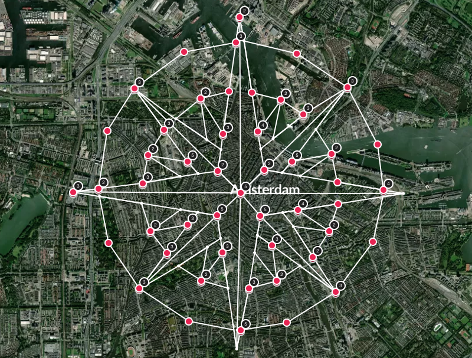

## Project purpose

Hacking the Polarstep's API to create custom path's shape.

## Demo

[See it live](https://www.polarsteps.com/oncleernest/3746713-polarstep-job-application)



## Dev stack

-  NodeJS

## Getting Started

### Prerequisites

-  Having Node.js installed `http://nodejs.org`
-  Once logged in in your polarstep account, create a new trip.
-  Copy the trip id in the URL (after your username) and patch it in the NodeJS code
-  Still on the Web UI, create a step manually while the Network console of your browser is opened. Note the value of the cookie field in the location and step requests and patch these value in the code.

### Dev dependencies

```sh
$ git clone https://github.com/aegiz/polarstep
$ cd polarstep
$ npm install

```

### Development

```sh
$ node polarstep.js
```
